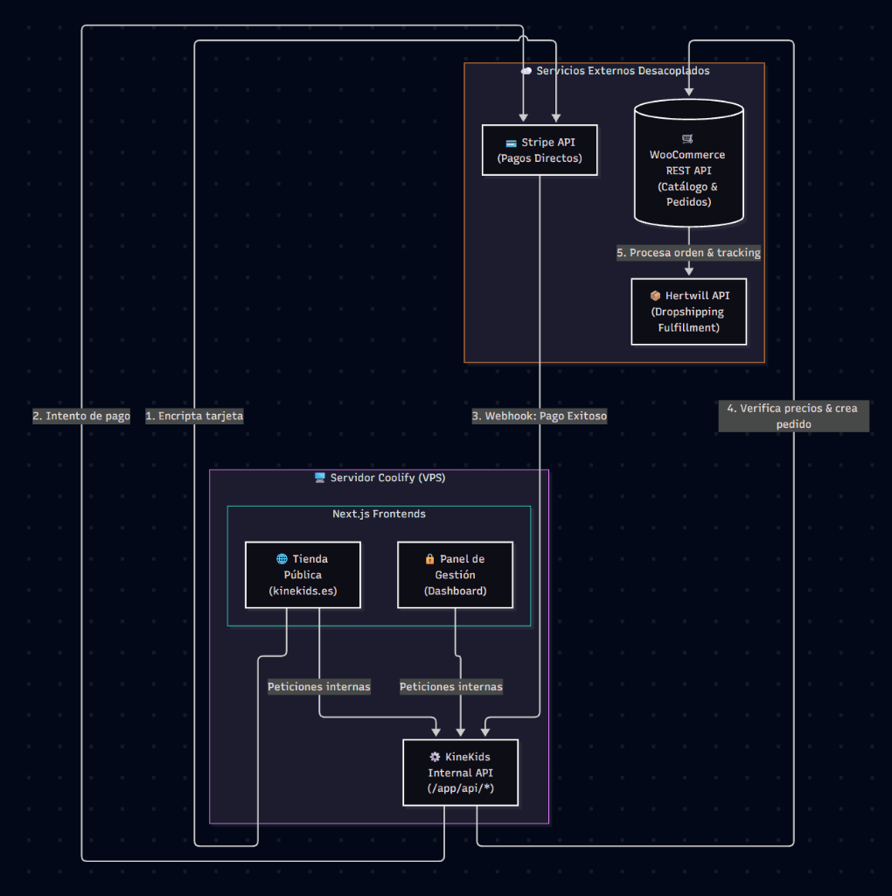

# 🧠 KineKids: Project Context & Architecture

Este documento actúa como la fuente de verdad (Single Source of Truth) para la arquitectura y reglas de negocio del proyecto KineKids. Su objetivo es unificar el contexto para desarrolladores e IAs.

---

## 1. 🎯 Contexto de Negocio (Business Context)
**KineKids** es una plataforma premium de comercio electrónico enfocada en el desarrollo infantil a través del **juego libre**.
- **Propuesta de valor:** Catálogo curado de juguetes libres de plásticos, sin componentes electrónicos, priorizando materiales nobles (madera) y el enfoque pedagógico.
- **Identidad Visual (UI/UX):** Diseño minimalista y premium ("wow effect"). Uso de una paleta orgánica (tonos tierra, arena, carbón) para transmitir profesionalismo y confianza.

---

## 2. 💻 Stack Tecnológico (Tech Stack)
El proyecto utiliza una arquitectura de **Monorepo** con un enfoque de comercio electrónico **Headless** (desacoplado).

- **Frontend (Web Pública - `uis/frontend`):** Next.js (App Router, Server Components).
- **Frontend (Panel Admin - `uis/backend`):** Next.js (App Router).
- **API Core & Microservicios:** **Python** (encargado de la orquestación dura, lógica interna y comunicación de APIs).
- **Estilos y UI:** Tailwind CSS.
- **Motor E-commerce (Base de Datos):** WooCommerce Headless (alojado en `proxy-kinekids.agencialquimia.com`).
- **Pagos:** Stripe API (vía Stripe Elements para PCI Compliance).
- **Infraestructura:** Despliegue en Coolify / Docker Compose.

---

## 3. 🗺️ Arquitectura del Sistema y Flujo de Datos

### Integraciones Clave:
1. **KineKids Internal API:** Interfaz centralizada. Los clientes web (React) nunca atacan directamente a las bases de datos externas; siempre pasan por esta API interna.
2. **WooCommerce REST API:** Actúa estrictamente como gestor de inventario y pedidos.
3. **Stripe API:** El flujo de pago requiere que la API interna (Python/Next.js) recalcule y verifique el total interactuando con WooCommerce antes de generar el Intento de Pago.
4. **Hertwill API:** Partner logístico de Dropshipping, sincronizado bidireccionalmente con WooCommerce para el fulfillment.

---

## 4. 🛑 Reglas y Restricciones (Constraints & Conventions)

- **Integridad Transaccional:** NUNCA se debe procesar o aceptar un precio que provenga del cliente web (navegador). Todo precio de carrito debe ser recalculado en el backend consultando el catálogo oficial antes del checkout en Stripe.
- **Seguridad (PCI Compliance):** Está estrictamente prohibido que nuestro servidor procese números de tarjeta de crédito (PAN) o CVVs. Se debe inyectar el iframe seguro de Stripe Elements.
- **Decisiones Arquitectónicas (ADRs):** Cualquier nueva funcionalidad crítica o cambio de integrador debe ser documentado primero como un *Architecture Decision Record* en `/docs/adr/`.
- **Despliegues Seguros:** Prohibido automatizar `git push` en los scripts de desarrollo. Toda subida a producción requiere validación de CI (Linters, TypeScript compilador).

---

## 5. 🛠️ Flujo de Trabajo (Development Workflow)

Todo el ciclo de vida del código en este repositorio está gobernado por la **Code Refinement Suite** (`.agents/skills/code-refinement-suite/SKILL.md`), la cual exige:
1. Definición del contrato técnico antes del código.
2. Desarrollo iterativo guiado por verificación fáctica.
3. Auditorías de seguridad y performance pre-commit.
