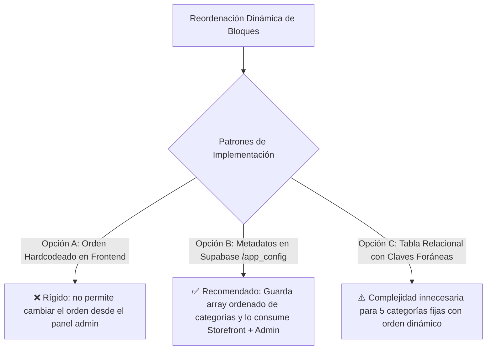
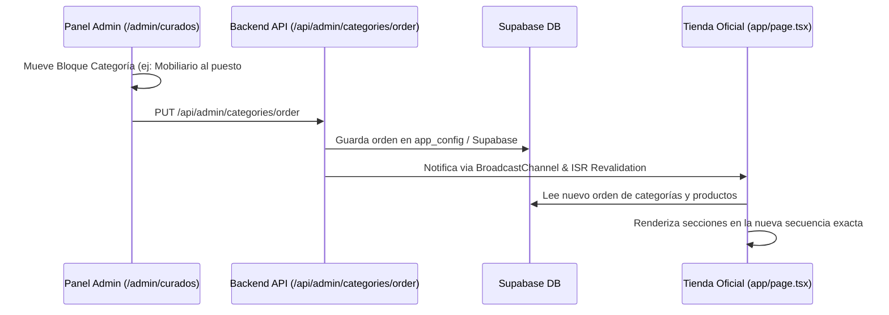

# Implementation Plan: Estructura Dinámica de 5 Categorías & Posicionamiento de Bloques para KineKids

**Documento:** `uis/backend/docs/plan-5-categorias-catalogo.md`  
**Skill Aplicada:** `Code Refinement Suite · AgenciAlquimia`  
**Nivel de Complejidad:** Nivel 3 (Arquitectura Dinámica de Bloques + Esquema DB Supabase + Hexagonal Core + Admin UI + Storefront Dynamic Sections)  
**Fecha:** 2026-09-26  
**Estado:** Listo para Aprobación & Ejecución  

---

## 🎯 1. Resumen Ejecutivo y Objetivos

Evolucionar la arquitectura de catálogo de KineKids hacia un **Sistema de 5 Categorías Totalmente Dinámicas y Reordenables**, donde el administrador tiene el control total no solo de la posición de cada tarjeta individual, sino también del **orden jerárquico de los 5 grandes bloques de categorías en la web**:

1. **Reordenación de Bloques de Categorías (Macro-Nivel):** Poder mover la posición de una categoría completa (ej: mover *Mobiliario & Estanterías* al puesto #1, *Sets de Psicomotricidad* al puesto #2, etc.) y que la tienda pública y el panel se rendericen automáticamente en esa misma secuencia.
2. **Reordenación de Tarjetas de Producto (Micro-Nivel):** Arrastrar y soltar productos (Drag & Drop) dentro de cada categoría para definir el orden exacto de los productos de cada sección.
3. **Persistencia & Single Source of Truth:** Guardar tanto el orden de las categorías como el `sort_order` de los productos en **Supabase** y propagar cambios en tiempo real vía `BroadcastChannel` / `revalidate`.

---

## 🏷️ 2. Matriz de las 5 Categorías Oficiales

| # Default | Código (`id` / `slug`) | Nombre Oficial en Tienda | Icono | Descripción Comercial / Pedagógica |
| :-: | :--- | :--- | :-: | :--- |
| **1** | `set` | **Sets de Psicomotricidad** | 🏆 | Conjuntos completos de bloques de espuma, castillos y piscinas de bolas (High Ticket). |
| **2** | `module` | **Módulos & Pikler** | 🪜 | Módulos individuales de gateo/trepa, triángulos Pikler con rampa, olas y balancines. |
| **3** | `furniture` | **Mobiliario & Estanterías** | 📚 | Estanterías Montessori (2, 3, 4 baldas), armarios, torres de aprendizaje transformables y mesas. |
| **4** | `nursery` | **Cunas & Carritos** | 🛏️ | Cunas evolutivas, cómodas cambiador a juego y carritos de bebé 2 en 1 / paseo. |
| **5** | `accessory` | **Sensorial & Accesorios** | 🎨 | Play Boxes por etapas, alfombras de suelo, colchonetas, pufs y complementos. |

---

## 📐 3. PACK 1: ARCHITECT (Evaluación ToT y Análisis de 3 Expertos)



### 🧠 Análisis de los 3 Expertos:
1. **Experto UX/UI (E-Commerce y Panel Admin):**
   * *Diagnóstico:* En el panel administrativo (/admin/curados) debemos tener una barra superior con las 5 pestañas donde cada pestaña tenga botones para mover categorías completas a la izquierda o derecha con 1 clic.
   * *Tienda Oficial:* La página principal (`app/page.tsx`) y la barra de navegación (`Header.tsx`) deben iterar dinámicamente sobre la lista ordenada de categorías activas, renderizando las secciones con anclas suaves (`#sets`, `#modulos`, `#mobiliario`, `#cunas-carritos`, `#accesorios`).
2. **Tech Lead / Arquitecto de Software:**
   * *Diagnóstico:* Crear una tabla o fila de configuración en Supabase (`app_config` o `category_order`) que almacene el orden: `["set", "furniture", "module", "nursery", "accessory"]`.
   * *Requisito:* Si la base de datos no tiene configuración aún, cargar el orden predeterminado de forma segura con fallback automático.
3. **Especialista en Seguridad & Rendimiento:**
   * *Diagnóstico:* Actualizar el check constraint en PostgreSQL `products_category_check` para permitir los 5 códigos válidos sin errores 400.
   * *Cero Latencia:* Carga dinámica en paralelo con Next.js Turbopack y propagación instantánea a pestañas activas.

---

## 📝 4. PACK 2: PLANNER (Plan de Implementación en 5 Fases)



### 🔹 Fase 1: Actualización de Esquema DB y Reclasificación en Supabase
1. Actualizar el constraint de validación en la tabla `products`:
   ```sql
   ALTER TABLE public.products DROP CONSTRAINT IF EXISTS products_category_check;
   ALTER TABLE public.products ADD CONSTRAINT products_category_check 
     CHECK (category IN ('set', 'module', 'furniture', 'nursery', 'accessory'));
   ```
2. Crear tabla / fila de persistencia del orden de categorías (`category_order`):
   ```sql
   CREATE TABLE IF NOT EXISTS public.app_config (
     key TEXT PRIMARY KEY,
     value JSONB NOT NULL,
     updated_at TIMESTAMPTZ DEFAULT NOW()
   );
   ```
3. Reclasificar los 184 productos existentes:
   * Estanterías One Little Pine, armarios, mesas, sillas, torres $
ightarrow$ `furniture`
   * Cunas ELIN, cambiadores ELIN, carritos Tutis, Noordi, mimbre $
ightarrow$ `nursery`
   * Módulos sueltos, rampas, balancines, triángulos Pikler $
ightarrow$ `module`
   * Sets completos de bloques y piscinas de bolas $
ightarrow$ `set`
   * Cajas Montessori, pufs, alfombras, textil $
ightarrow$ `accessory`

### 🔹 Fase 2: Endpoint de Ordenación de Categorías (`/api/admin/categories/order`)
* **GET:** Devuelve la lista ordenada de las 5 categorías con sus metadatos (nombre, slug, icono, descripción, contador de productos).
* **PUT:** Recibe el nuevo array ordenado de categorías, lo persiste en Supabase (`app_config`), actualiza los JSONs locales y dispara la revalidación del frontend.

### �� Fase 3: Tipados TypeScript & Puertos Hexagonales
* Extender `ProductCategory` a los 5 valores:
  ```typescript
  export type ProductCategory = "set" | "module" | "furniture" | "nursery" | "accessory";
  ```
* Actualizar puertos y adaptadores en `uis/backend` y `uis/frontend`.

### 🔹 Fase 4: Panel Administrativo (`/admin/curados`)
* **Organizador de Bloques Superior:**
  * Pestañas interactivas con botones para mover categorías completas a la izquierda o derecha (`⬅️ Mover Bloque` / `➡️ Mover Bloque`).
  * Indicador de orden visual: *Bloque #1*, *Bloque #2*, *Bloque #3*, *Bloque #4*, *Bloque #5*.
* **Organizador de Tarjetas:**
  * Mover tarjetas de producto (Drag & Drop + Botones `⬅️` `➡️`) dentro de la categoría seleccionada.
  * Selector de categoría en cada tarjeta actualizado con las 5 opciones.

### 🔹 Fase 5: Renderizado Dinámico en la Tienda Oficial (`app/page.tsx` y Header)
* `app/page.tsx` consulta el orden de categorías y renderiza las 5 secciones en bucle dinámico según la secuencia guardada en el panel admin.
* `Header.tsx` actualiza los enlaces del menú superior en ese mismo orden exacto.

---

## 💻 5. PACK 3: CODER (Matriz de Archivos a Modificar)

| Módulo | Archivo | Acción |
| :--- | :--- | :--- |
| **DB Migration** | Supabase SQL Query | Constraint 5 categorías + tabla `app_config` + reclasificación |
| **API Backend** | `uis/backend/app/api/admin/categories/order/route.ts` | Endpoint GET y PUT para orden de bloques |
| **API Backend** | `uis/backend/app/api/admin/products/sync/route.ts` | Admite las 5 categorías |
| **Admin UI** | `uis/backend/app/admin/curados/page.tsx` | Gestor de orden de bloques de categoría + tarjetas |
| **Backend Core** | `uis/backend/lib/ports/catalog.port.ts` | Tipos `ProductCategory` |
| **Frontend Core** | `uis/frontend/lib/ports/catalog.port.ts` | Tipos `ProductCategory` |
| **Frontend API** | `uis/frontend/app/api/categories/route.ts` | Endpoint público para leer orden de categorías |
| **Frontend UI** | `uis/frontend/app/page.tsx` | Renderizado dinámico de los 5 bloques en orden |
| **Frontend Nav** | `uis/frontend/components/Header.tsx` | Menú de navegación dinámico |

---

## 🛡️ 6. PACK 4: AUDITOR (Criterios de Aceptación Pre-Despliegue)

- [ ] **Persistencia de Bloques:** Mover la categoría *"Mobiliario & Estanterías"* al puesto #1 en el panel admin y verificar que en la base de datos se guarda como primera posición.
- [ ] **Renderizado en Tienda:** Verificar en `localhost:3000` que la sección de *"Mobiliario & Estanterías"* aparece como la primera sección debajo del Hero banner.
- [ ] **Reordenación Interna de Tarjetas:** Mover una estantería dentro de *"Mobiliario"* al puesto #1 y comprobar que aparece como la primera tarjeta de su bloque.
- [ ] **Compilación:** Ejecutar `npm run build` en backend y frontend (0 errores TypeScript).
- [ ] **Protocolo Git:** Confirmar con el usuario antes de ejecutar `git push`.
