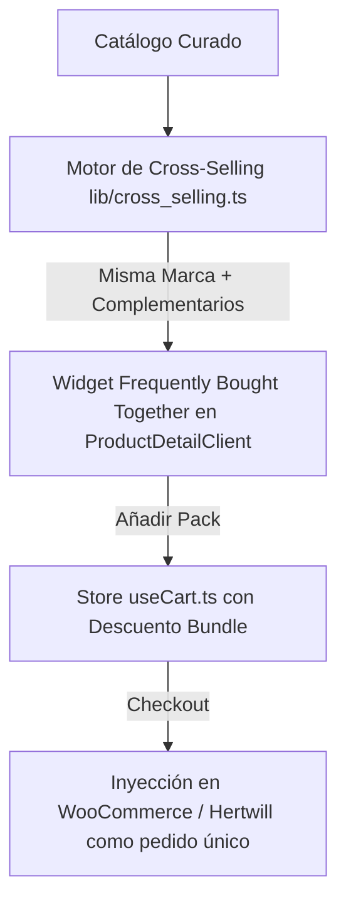

# 📋 Plan de Implementación: Detección de Productos Similares y Ofertas Cross-Selling por Marca (Optimización Logística de Envíos)
> **Metodología:** Code Refinement Suite · AgenciAlquimia (Nivel 3: Alta Complejidad)  
> **Objetivo:** Identificar productos complementarios del mismo fabricante (ej. MeowBaby, leg&go, etc.) para crear ofertas dinámicas por lotes (*Bundle Deals* / *Frecuentemente Comprados Juntos*), aprovechando el envío consolidado para maximizar el margen neto y el ticket promedio (AOV).

---

## 📐 PACK 1: ARCHITECT (Ideación y Comparativa ToT)

### 1.1. Análisis ToT (Tree of Thoughts - 3 Enfoques de Ofertas Cross-Selling)
1. **Rama A (Hardcoded / Reglas Estáticas Manuales):** Crear bundles específicos fijados a mano desde el panel admin.
   - *Pros:* Control total sobre combinaciones destacadas.
   - *Contras:* Poco escalable si se añaden más productos o variantes.
2. **Rama B (Detección Heurística Dinámica por Marca + Categoría Complementaria - RECOMENDADA):** Motor inteligente que detecta productos del mismo fabricante y diferente categoría funcional (ej: Set de Espuma + Piscina de Bolas o Triángulo Pikler + Rampa).
   - *Pros:* 100% automático, cubre todo el catálogo, garantiza que los productos salgan del mismo almacén logístico.
   - *Contras:* Requiere normalizar correctamente el identificador de marca o proveedor en el catálogo.
3. **Rama C (IA Recommender con Embedding Vectorial):** Sistema con OpenAI Embeddings para recomendar artículos visualmente o funcionalmente similares.
   - *Pros:* Muy avanzado.
   - *Contras:* Podría sugerir productos de marcas distintas (rompiendo la ventaja del envío consolidado).

**Decisión Arquitectónica:** Se adopta la **Rama B con soporte de Override Manual** (motor inteligente con filtro estricto de mismo proveedor + selector manual opcional en admin).

### 1.2. Análisis de los 3 Expertos
- 🎨 **Experto UX/UI:** Diseñar una sección visual y persuasiva en la ficha de producto (`ProductDetailClient.tsx`) con un widget de *"Completa tu Set y ahorra un 15% en el 2º producto"* con checkboxes interactivos y botón directo de *"Añadir Pack al Carrito"*.
- 💻 **Experto Dev / Backend:** Motor en `lib/cross_selling.ts` que calcule en tiempo real el precio del pack, el descuento ofrecido (ej. 10-15%) y valide que el margen neto del pedido combinado supere con creces la venta individual gracias al ahorro de ~33€ en el segundo envío.
- 🛡️ **Experto Seguridad / Negocio:** Validación de que el descuento nunca deje el margen bruto por debajo del 20% sobre costes totales.

---

## 📝 PACK 2: PLANNER (Estructuración y Ciclo de Refinamiento)

### 2.1. Modelo Matemático del Margen por Envío Consolidado
- **Caso 1: Venta de 2 productos por separado (2 clientes distintos):**
  - Producto 1 (PVP 148€, Coste 99€, Envío 33€) $
ightarrow$ Margen Neto: $148 - 132 = \mathbf{+16€}$
  - Producto 2 (PVP 85€, Coste 35€, Envío 33€) $
ightarrow$ Margen Neto: $85 - 68 = \mathbf{+17€}$
  - **Margen total:** $16€ + 17€ = \mathbf{33€}$ (facturando 233€)
- **Caso 2: Venta en Pack / Cross-Selling a un mismo cliente (Envío único 33€):**
  - Pack con 10% de descuento en el 2º producto: PVP Total $= 148€ + 76.50€ = \mathbf{224.50€}$
  - Costes totales: Coste 1 (99€) + Coste 2 (35€) + **Envío Único (33€)** $= \mathbf{167€}$
  - **Margen Neto Real:** $224.50€ - 167€ = \mathbf{+57.50€}$ $(+74\%$ de beneficio neto adicional en una sola transacción).

### 2.2. Componentes a Implementar

1. **`uis/backend/lib/cross_selling.ts` & `uis/frontend/lib/cross_selling.ts`**:
   - Función `getBrandCompatibleAddons(productId, catalog)`: extrae productos del mismo fabricante con compatibilidad temática (ej: Módulos + Colchoneta, Pikler + Rampa, Cuna + Textil).
   - Función `calculateBundlePricing(mainProduct, addonProduct, discountPercent = 10)`.
2. **`uis/frontend/components/products/BundleOfferWidget.tsx`**:
   - Widget interactivo con tarjetas enlazadas por un signo `+`, selector de variantes de color del accesorio, cálculo de ahorro en tiempo real e indicador visual *"Envío unificado sin coste extra"*.
3. **`uis/frontend/hooks/useCart.ts`**:
   - Capacidad de aplicar descuento de paquete (*bundle discount*) al añadir productos combinados.

---

## 💻 PACK 3: CODER (Plan de Ejecución)

- [ ] **Fase 1:** Crear el motor de afinidad de marca y compatibilidad en `lib/cross_selling.ts`.
- [ ] **Fase 2:** Crear el componente UI `BundleOfferWidget.tsx` con micro-animaciones y selector de variantes del producto recomendado.
- [ ] **Fase 3:** Integrar el widget en [ProductDetailClient.tsx](file:///root/.openclaw/worktrees/kinekids-web/uis/frontend/app/products/%5Bid%5D/ProductDetailClient.tsx#L480-L520) justo debajo del selector principal de compra y antes de las especificaciones.
- [ ] **Fase 4:** Actualizar `useCart` para soportar la adición atómica del pack con etiqueta de promoción visible en el carrito.
- [ ] **Fase 5:** Pruebas unitarias de cálculo de margen y verificación estricta de tipos (`npm test`, `tsc`).

---

## 🛡️ PACK 4: AUDITOR (Verificación y Protocolo Git)

- [ ] Auditoría de accesibilidad WCAG en los checkboxes y selectores del pack.
- [ ] Comprobación de no regresión en el proceso de pago / checkout.
- [ ] Verificación de que todos los tests unitarios pasen al 100%.
- [ ] **Protocolo Git:** Solicitar confirmación explícita del usuario antes de realizar cualquier commit / push.
