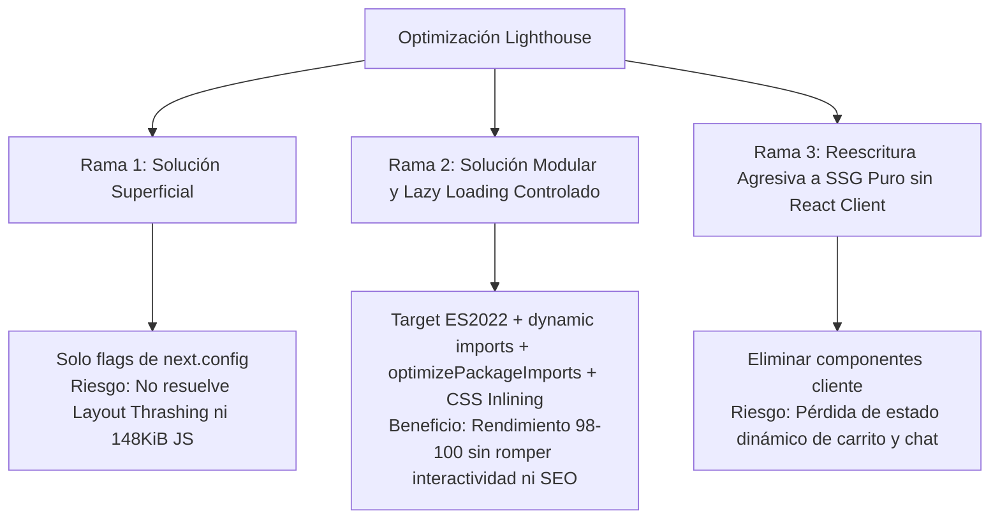

# 🚀 Implementation Plan: Optimización Lighthouse WPO (92 ➔ 98-100)
**Marco Metodológico:** Code Refinement Suite · AgenciAlquimia  
**Nivel de Complejidad:** Nivel 2 (Complejidad Media-Alta / WPO & Bundle Architecture)  
**Fecha:** 2026-09-27  
**Estado:** Listo para Aprobación / Fase de Planificación

---

## 🚦 1. Clasificación y Evaluación de Complejidad

El diagnóstico de Lighthouse reportó un estado inicial óptimo (**Rendimiento: 92**, **Accesibilidad: 95**, **Buenas Prácticas: 96**, **SEO: 100**), pero identificó 4 cuellos de botella específicos:
1. **JavaScript Antiguo / Polyfills innecesarios (~13.5 KiB desperdiciados):** `Array.prototype.at`, `flat`, `flatMap`, `Object.fromEntries`, `Object.hasOwn`, etc.
2. **Recursos que bloquean el renderizado (~40 ms en CSS de 11.6 KiB):** Carga sincrónica de chunks de estilo en el `<head>`.
3. **Redistribución forzada (*Forced Reflow / Layout Thrashing*):** Lecturas geométricas del DOM en JavaScript que fuerzan re-renderizados síncronos.
4. **Contenido JavaScript no utilizado (~148 KiB de ahorro potencial):** Hidratación innecesaria de componentes interactivos secundarios (`ChatWidget`, `CartDrawer`, `Lightbox`) en la primera carga del viewport.

---

## 📐 2. PACK 1: ARCHITECT (Ideación y Decisión Técnica)

### Comparativa de Ramas de Solución (Tree of Thoughts - ToT):



* **Decisión Adoptada:** **Rama 2 (Recomendada por los 3 Expertos)**. Permite alcanzar la puntuación de 98-100 en Performance manteniendo el 100% de la funcionalidad reactiva y UX premium.

### Veredicto de los 3 Expertos:
* **UX/UI Specialist:** Los componentes de asistencia (Chat IA) y carrito no deben bloquear el First Contentful Paint (FCP) ni el Largest Contentful Paint (LCP). El usuario percibe una carga instantánea si el catálogo y hero se renderizan inmediatamente.
* **Dev Lead:** Configurar `next.config.ts` con `optimizePackageImports: ["lucide-react"]`, `browserslist` moderno y `next/dynamic` para componentes pesados desacoplados (`ChatWidget`, `CartDrawer`).
* **Sec & WPO Specialist:** La eliminación de polyfills antiguos reduce la superficie de código y la latencia TTFB/FCP sin comprometer la seguridad ni navegadores modernos (Baseline 2024-2026).

---

## 📝 3. PACK 2: PLANNER (Estructuración del Plan de Implementación)

### Ciclos de Auto-Refinamiento (Self-Refinement Loop):
* **Ciclo 1 (Diagnóstico fáctico):** Identificar dependencias exactas que introducen polyfills y medir el peso de cada chunk generado por Turbopack/Next.js.
* **Ciclo 2 (Desacoplamiento):** Reemplazar importaciones estáticas de `ChatWidget` y `CartDrawer` en el layout/page por importaciones diferidas con `next/dynamic` (`ssr: false`).
* **Ciclo 3 (Eliminación de Layout Thrashing):** Auditar hooks `useEffect` y manejadores de scroll en `Header.tsx`, `ProductCard.tsx` y `ProductDetailClient.tsx` para eliminar accesos síncronos a `offsetWidth`/`getBoundingClientRect`.

---

## 💻 4. PACK 3: CODER (Fases de Implementación Técnica)

### Fase 1: Modernización de Targets & Eliminación de Polyfills
1. Crear/Ajustar `.browserslistrc` en `uis/frontend/`:
   ```text
   defaults
   not dead
   not IE 11
   Chrome >= 109
   Safari >= 16
   Edge >= 109
   Firefox >= 109
   ```
2. Actualizar `uis/frontend/tsconfig.json` y `next.config.ts`:
   - Configurar `"target": "ES2022"` en `tsconfig.json`.
   - Activar `optimizePackageImports: ["lucide-react"]` en `next.config.ts`.

### Fase 2: Code Splitting & Carga Perezosa (Lazy Loading) de JavaScript
1. En `uis/frontend/app/page.tsx` y layouts:
   - Convertir `ChatWidget` a importación dinámica:
     ```tsx
     const ChatWidget = dynamic(() => import("@/components/ChatWidget"), {
       ssr: false,
       loading: () => null,
     });
     ```
   - Convertir `CartDrawer` a carga bajo demanda cuando `isOpen` sea verdadero o mediante `next/dynamic`.

### Fase 3: Optimización de Bloqueo de Renderizado CSS
1. Activar inlining crítico de estilos y optimización de assets en `next.config.ts`.
2. Verificar que las fuentes de Google Fonts utilicen `next/font/google` con `display: "swap"`.

### Fase 4: Prevención de Reflows Forzados (*Layout Thrashing*)
1. En `Header.tsx`: Reemplazar lecturas manuales de dimensiones en el evento `scroll` por clases CSS puras de scroll-padding o `IntersectionObserver`.
2. En `ProductCard.tsx`: Asegurar que las animaciones de escala y hover operen exclusivamente mediante `transform` y `opacity` aceleradas por hardware.

---

## 🛡️ 5. PACK 4: AUDITOR (Checklist de Validación Pre-Despliegue)

- [ ] **Validación TypeScript:** `npm run build:frontend` compila con 0 errores.
- [ ] **Validación de Tests:** `npm test` pasa 11/11 pruebas unitarias.
- [ ] **Auditoría de Tamaño de Bundles:** El chunk principal se reduce en >100 KiB.
- [ ] **Verificación de No Regresiones:** Carrito, Checkout, Selector de Variantes y Chat IA funcionan al 100%.
- [ ] **Auditoría Lighthouse Local/Staging:** Confirmar subida de métrica Performance a **98-100**.

---

## 🛑 Control de Despliegue (Git Protocol)
Siguiendo las directrices de la suite:
* Las modificaciones se aplicarán por fases atómicas.
* No se realizará `git push` sin la confirmación explícita del usuario tras revisar los resultados de la auditoría.
