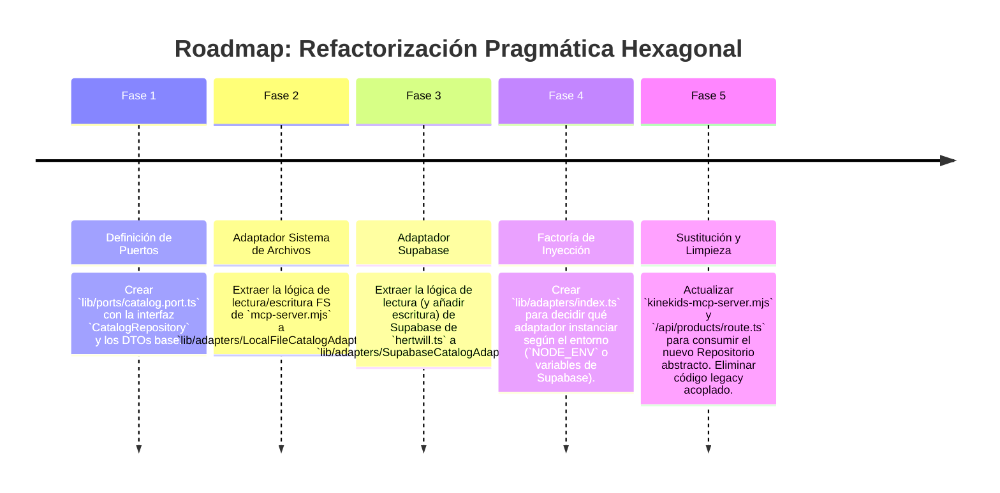

# 🛑 Plan de Implementación: Refactorización Pragmática (Inspiración Hexagonal)

Este documento detalla el plan para desacoplar la capa de infraestructura (llamadas HTTP, Base de Datos, Sistema de Archivos) de la lógica de negocio en `KineKids`, aplicando principios de Arquitectura Hexagonal de forma pragmática. Este plan se centra específicamente en resolver el problema crítico de persistencia del catálogo curado.

---

## 1. 🎯 Objetivo Estratégico

Resolver el fallo crítico de persistencia en producción (donde los productos guardados por el MCP/Admin desaparecen al redesplegar) separando responsabilidades. El objetivo es que la lógica central de KineKids no sepa *dónde* se guardan los datos, delegando esa tarea a "Adaptadores" intercambiables (Archivos locales en Dev, Supabase en Prod).

---

## 2. 🧙‍♂️ Análisis de la Propuesta mediante el Método de los 3 Expertos

### 🏗️ Experto 1: Arquitecto de Software (Clean Architecture)
*   **Análisis:** Actualmente, `kinekids-mcp-server.mjs` lee y escribe directamente en el sistema de archivos (`fs.writeFileSync`), y `lib/hertwill.ts` mezcla lógica de precios con llamadas `fetch` a la API externa y consultas a Supabase. Este alto acoplamiento causa fragilidad (como el fallo de despliegue).
*   **Decisión:** Introducir el patrón **"Repository"** (un tipo de Adaptador). Crearemos un contrato (Interfaz) para el catálogo. En desarrollo o modo mock, el repositorio usará archivos locales. En producción, el repositorio inyectado será el que hable con Supabase.

### ⚙️ Experto 2: Ingeniero Backend & DevOps (Next.js / Node.js)
*   **Análisis:** No necesitamos un contenedor de Inyección de Dependencias pesado como InversifyJS (común en Hexagonal pura). Podemos usar inyección manual simple o fábricas factorías (`CatalogRepositoryFactory.get()`) basadas en las variables de entorno (`NODE_ENV` o `SUPABASE_URL`).
*   **Decisión:** Mantenerlo simple. Crear la carpeta `lib/adapters/`. Migrar la lectura/escritura de `fs` y Supabase a estos adaptadores, manteniendo la API de Next.js y el Servidor MCP limpios y enfocados solo en el enrutamiento y la exposición de herramientas.

### 🛡️ Experto 3: Líder de Calidad & QA
*   **Análisis:** Refactorizar el acceso a datos es una operación de alto riesgo que puede tumbar la página de productos o el panel admin.
*   **Decisión:** El refactor debe hacerse en paralelo al código existente, no reemplazándolo inmediatamente (patrón Estrangulador). Primero se crean los adaptadores, luego se prueba su funcionalidad aislada, y finalmente se cambia la referencia en `mcp-server.mjs` y `route.ts`.

---

## 3. 🔄 Self-Refinement Loop (3 Ciclos de Refinamiento Iterativo)

```mermaid
graph TD
    A[Problema: Pérdida de persistencia en Prod] --> B[Loop 1: Abstracción de Interfaces (Puertos)]
    B --> C[Loop 2: Implementación de Adaptadores (FileSystem vs Supabase)]
    C --> D[Loop 3: Inyección Pragmática en MCP y Next.js]
    D --> E[Arquitectura Desacoplada y Persistente]
```

### 🔁 Ciclo 1: Abstracción de Interfaces (Los Puertos)
*   **Planteamiento:** Crear interfaces TypeScript complejas para todo.
*   **Crítica de Refinamiento:** Sobreingeniería. Solo nos duele el catálogo curado ahora mismo.
*   **Solución Refinada:** Definir solo un "Puerto" (Interfaz) estricto: `CatalogRepository`. Este contrato dictará qué métodos existen: `getCuratedProducts(): Promise<Product[]>`, `saveCuratedProducts(products: Product[]): Promise<void>`.

### 🔁 Ciclo 2: Implementación de Adaptadores
*   **Planteamiento:** Modificar los archivos actuales (`hertwill.ts` y `mcp-server.mjs`) para que hagan `if(prod) Supabase else FS`.
*   **Crítica de Refinamiento:** Eso sigue violando el Principio de Responsabilidad Única. El archivo sigue sabiendo de dos tecnologías distintas.
*   **Solución Refinada:** Crear dos archivos separados en una nueva ruta: `lib/adapters/LocalFileCatalogAdapter.ts` y `lib/adapters/SupabaseCatalogAdapter.ts`. Ambos cumplen con la interfaz `CatalogRepository`. El código de la infraestructura queda 100% aislado.

### 🔁 Ciclo 3: Inyección Pragmática
*   **Planteamiento:** Usar una librería pesada de Inyección de Dependencias.
*   **Crítica de Refinamiento:** Innecesario y añade peso al bundle de Next.js.
*   **Solución Refinada:** Crear un archivo `lib/adapters/index.ts` que actúe como factoría. Si detecta credenciales de Supabase en el entorno, exporta la instancia del `SupabaseCatalogAdapter`. Si no, exporta el `LocalFileCatalogAdapter`. El resto de la aplicación (MCP y Next.js) solo importa desde este `index.ts`.

---

## 4. 🗺️ Roadmap de Implementación por Fases



---

**Fecha de Creación:** 2026-08-24
**Autor:** Mercurio (Agente IA de OpenClaw)
