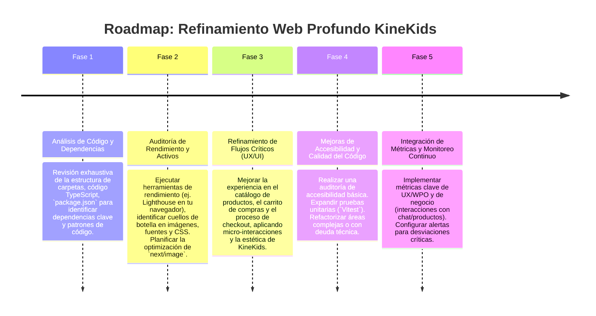

# ✨ Plan de Refinamiento Web Profundo: KineKids

Este documento presenta un plan de refinamiento web profundo para el proyecto `KineKids`, aplicando la `code-refinement-suite` (Nivel 3). El objetivo es optimizar el rendimiento, la usabilidad, la accesibilidad, la calidad del código y la coherencia del diseño, siempre respetando la identidad visual escandinava/minimalista existente.

---

## 1. 🎯 Objetivo Estratégico del Refinamiento

Mejorar la experiencia global de usuario (UX), la eficiencia técnica y la escalabilidad del proyecto `KineKids`, consolidando su posición como una plataforma de e-commerce o catálogo de productos pedagógicos avanzada y centrada en IA, con un diseño pulcro y funcional.

---

## 2. 🧙‍♂️ Análisis de la Propuesta mediante el Método de los 3 Expertos

### 🎨 Experto 1: Diseñador UX/UI & Branding (KineKids Aesthetics)
*   **Análisis:** La identidad visual existente (minimalista escandinava, tonos arena, arcilla, salvia, fuentes Montserrat/Geist Sans) es un activo. El refinamiento debe potenciarla sin alterarla. La atención se centrará en micro-interacciones, espaciado, tipografía (tamaños/jerarquía) y la fluidez visual en el contexto de un catálogo de productos.
*   **Decisión:** Asegurar que los componentes interactivos (botones, enlaces, elementos de carrito) tengan estados visualmente claros y elegantes que armonicen con la paleta de `KineKids`. Revisar la consistencia de los espaciados (margins, paddings) y la alineación de los elementos. Mejorar la legibilidad y jerarquía de la información de los productos en las `ProductCard` y `ProductDescription`.

### ⚙️ Experto 2: Ingeniero Frontend & Especialista en WPO (Next.js 16, React 19, TS, Tailwind)
*   **Análisis:** El uso de Next.js 16 con App Router y React 19 es una base sólida. La directriz `images: { unoptimized: true }` en `next.config.ts` es una clara oportunidad de mejora de rendimiento. La integración con Hertwill (API externa) y Supabase (BaaS) requiere una gestión eficiente de datos y posibles cachés.
*   **Decisión:** Priorizar la optimización de imágenes (Fase 3). Implementar estrategias de `data fetching` eficientes y `revalidación` para el catálogo de productos. Auditar el `bundle size` de la aplicación para identificar y reducir dependencias innecesarias. Refinar la gestión de estado con `Zustand` para evitar re-renderizados excesivos.

### 🔐 Experto 3: Líder de Seguridad, Privacidad & Mantenibilidad (DevOps)
*   **Análisis:** La dependencia de `HERTWILL_API_KEY` (aunque ya en `.env.local`) y la conexión a Supabase requieren un escrutinio continuo. El sistema MCP (`kinekids-mcp-server.mjs`) debe ser robusto y protegido. La calidad del código (TypeScript estricto) es buena, pero las pruebas unitarias y de integración son esenciales para la mantenibilidad a largo plazo.
*   **Decisión:** Reforzar las prácticas de seguridad para `HERTWILL_API_KEY` (posiblemente con rotación periódica si aplica). Asegurar una gestión de errores robusta en las llamadas a APIs externas. Expandir la cobertura de pruebas (`Vitest`) para componentes clave (ej., `CartDrawer`, `ProductCard`) y funciones de lógica (`lib/pricing.ts`, `lib/hertwill.ts`).

---

## 3. 🔄 Self-Refinement Loop (3 Ciclos de Refinamiento Iterativo)

```mermaid
graph TD
    A[Borrador Inicial: Pequeñas mejoras de UI/rendimiento] --> B[Loop 1: Optimización de Activos Críticos (Imágenes, Fuentes)]
    B --> C[Loop 2: Flujos de Usuario Críticos (Catálogo, Carrito, Checkout)]
    C --> D[Loop 3: Coherencia Técnica y Mantenibilidad]
    D --> E[Plan Final: Web KineKids Pulida y de Alto Rendimiento]
```

### 🔁 Ciclo 1: Optimización de Activos Críticos (Imágenes y Fuentes)
*   **Planteamiento Inicial:** Las imágenes no optimizadas y la carga de fuentes genérica.
*   **Crítica de Refinamiento:** Las imágenes no optimizadas (`unoptimized: true`) pueden ser un cuello de botella significativo para el rendimiento (LCP). La carga de fuentes puede causar `FOIT`/`FOUT`.
*   **Solución Refinada:**
    1.  **Imágenes:** Revertir `unoptimized: true` en `next.config.ts` y usar el componente `next/image` con optimización automática. Evaluar formatos modernos como WebP/AVIF. Implementar `placeholder="blur"` o `"empty"` para mejorar la UX durante la carga.
    2.  **Fuentes:** Asegurar que las fuentes Montserrat y Geist Sans se precargan (`preload`) eficientemente y que tienen `font-display: swap` para evitar bloqueos de renderizado.

### 🔁 Ciclo 2: Flujos de Usuario Críticos (Catálogo, Carrito, Checkout)
*   **Planteamiento Inicial:** Funcionalidad básica de catálogo y carrito.
*   **Crítica de Refinamiento:** En un e-commerce, estos flujos son el corazón del negocio. Pequeñas fricciones pueden llevar a la pérdida de conversiones. La experiencia debe ser impecable y fluida, especialmente en móvil.
*   **Solución Refinada:**
    1.  **Catálogo/Listado de Productos (`app/products/`):** Implementar carga infinita o paginación más suave. Mejorar la experiencia de filtrado/búsqueda. Asegurar que las `ProductCard` son responsivas y claras.
    2.  **Carrito (`CartDrawer.tsx`):** Optimizar las interacciones de añadir/quitar. Proporcionar feedback visual instantáneo. Asegurar que el estado del carrito sea persistente entre sesiones si es deseable.
    3.  **Checkout (`app/checkout/`):** Simplificar los pasos al máximo. Validaciones en tiempo real. Proporcionar mensajes de error claros y asistencia. Minimizar campos requeridos.

### 🔁 Ciclo 3: Coherencia Técnica y Mantenibilidad del Diseño
*   **Planteamiento Inicial:** Estilos y componentes desarrollados orgánicamente.
*   **Crítica de Refinamiento:** La coherencia visual y de código es vital para la marca KineKids y la escalabilidad del equipo. Es necesario auditar y unificar patrones.
*   **Solución Refinada:**
    1.  **Componentes UI:** Crear o refinar un `components/ui/Button.tsx` (respetando la paleta de KineKids) y otros componentes básicos para garantizar la consistencia en todos los elementos interactivos. (Esto se alinea con el `elegant-buttons-implementation-plan.md` general, pero adaptado a la estética de KineKids).
    2.  **Tokens de Diseño:** Documentar y asegurar que los tokens de color, espaciado y tipografía definidos en `@theme` de `globals.css` se utilicen consistentemente en todos los componentes con TailwindCSS.
    3.  **Refactorización:** Identificar cualquier componente o módulo con alta complejidad cíclica o baja cohesión y refactorizarlo para mejorar la legibilidad y mantenibilidad.

---

## 4. 🗺️ Roadmap de Implementación por Fases



---

**Fecha de Creación:** 2026-08-24
**Autor:** Mercurio (Agente IA de OpenClaw)
