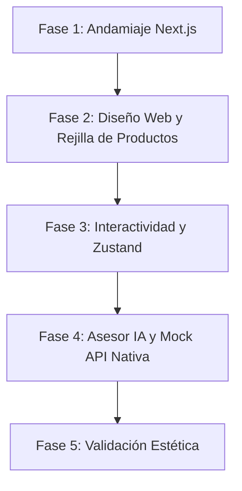

# Plan de Levantamiento Estético y Frontend de KineKids

Este documento establece el plan simplificado para el levantamiento estético del frontend y la interfaz de usuario de **KineKids**. El objetivo principal es construir una interfaz web premium y un prototipo interactivo fluido que demuestre la propuesta de valor de la marca utilizando un stack moderno en un entorno unificado, sin complejidades de infraestructura de base de datos o microservicios externos.

---

## 1. Estrategia de Levantamiento y Stack Tecnológico

La estrategia se centra en la velocidad de desarrollo de la interfaz, la excelencia visual (diseño minimalista escandinavo) y la interactividad fluida, consolidando el cliente y la API en un único framework.

### 1.1 Stack Tecnológico Simplificado (Full-Stack Next.js)

Utilizaremos un conjunto de herramientas optimizado para prototipado rápido y diseño de alta fidelidad, manteniendo todo bajo el ecosistema de Node.js:

```text
[Cliente (Next.js React Server Components)] 
                   | (Llamadas Nativas / SSE)
                   v
[Next.js API Routes (Route Handlers)] <===> [Gemini API (Vercel AI SDK) / JSON Mock]
                   |
[Tailwind, Shadcn UI, Framer Motion, Zustand]
```

*   **Frontend y Backend Unificado:** **Next.js (React)** actuando como framework full-stack. Las interfaces se renderizan en el cliente/servidor, y los datos se sirven directamente desde la carpeta `app/api/`.
*   **Diseño y Estilizado:** **TailwindCSS** para un maquetado limpio y coherentemente visual con la identidad de marca.
*   **Micro-animaciones:** **Framer Motion** para dotar al sitio del concepto de movimiento fluido (*kinesis*).
*   **Componentes de UI:** **Shadcn UI** y **Lucide Icons** para controles, botones y modales estéticos.
*   **Estado del Cliente:** **Zustand** para gestionar el estado local del carrito de compras y la ventana de chat.
*   **Integración IA:** **Vercel AI SDK** para manejar el streaming (Server-Sent Events) de Antigravity (Gemini) directamente desde las rutas de Next.js.

---

### 1.2 Fases del Levantamiento Estético (Setup Rápido)



#### Fase 1: Andamiaje e Inicialización (Next.js Full-Stack)
*   **Setup Único:** Crear el proyecto Next.js en el directorio raíz (`npx create-next-app@latest ./ --typescript --tailwind --app`).
*   **Configuración de Estilos:** Cargar la tipografía geométrica (ej., *Inter* u *Montserrat*) y definir los colores tierra minimalistas en `tailwind.config.ts`.
*   **Instalación de Core:** Instalar dependencias clave (`npm i framer-motion zustand ai @ai-sdk/google`).
*   **Entregables:** Servidor de Next.js ejecutándose localmente en el puerto 3000 con soporte para UI y backend.

#### Fase 2: Diseño Web y Maquetación (Value Ladder Grid)
*   **Diseño Escandinavo:** Implementar la interfaz visual basada en los Stitch Prototypes (minimalismo, abundancia de espacio en blanco, colores orgánicos).
*   **Rejilla del Value Ladder:** Crear un catálogo de productos estático dividido visiblemente en:
    1.  **Sets Completos (High Ticket):** Presentación grande y premium al inicio.
    2.  **Módulos Individuales (Mid Ticket):** Rejilla secundaria con opciones complementarias.
    3.  **Accesorios Sensoriales (Low Ticket):** Galería compacta al final.
*   **Entregables:** Páginas estáticas del Home y catálogo de productos completamente maquetadas y responsivas.

#### Fase 3: Interactividad y Micro-animaciones (Zustand & Framer Motion)
*   **Estado del Carrito:** Implementar Zustand para agregar, remover y calcular totales de productos en un modal lateral de carrito.
*   **Animaciones KineKids:** Configurar animaciones de entrada fluidas y transiciones sutiles de escala al interactuar con las tarjetas utilizando Framer Motion.
*   **Entregables:** Interfaz reactiva donde el usuario puede previsualizar la compra con transiciones suaves.

#### Fase 4: Mock de Datos y Chat IA (Next.js API Routes)
*   **Catálogo Mock:** Crear el endpoint `app/api/products/route.ts` para servir el catálogo en formato JSON a los componentes cliente.
*   **Endpoint de Chat:** Crear `app/api/chat/route.ts` utilizando Vercel AI SDK para conectarse a Google Gemini y devolver el flujo de texto (streaming) con el rol de Asesor Pedagógico.
*   **Widget en el Cliente:** Crear el componente de chat flotante utilizando el hook `useChat` proporcionado por el SDK.
*   **Entregables:** Catálogo dinámico consumiendo la API local y chat IA en tiempo real, operando exclusivamente dentro del ecosistema Next.js.

#### Fase 5: Validación Estética y Pulido Final
*   **Core Web Vitals:** Probar el rendimiento de renderizado en Chrome DevTools.
*   **Revisión del Prototipo:** Verificar que la interfaz represente el valor pedagógico premium de KineKids.
*   **Entregables:** Prototipo visual completo corriendo localmente, listo para demostraciones y posterior conexión a Supabase.

---

## 2. Modelado de Datos de Simulación (Next.js API Route)

El catálogo de productos se servirá de forma nativa a través de los Route Handlers de Next.js.

**Archivo: `app/api/products/route.ts`**
```typescript
import { NextResponse } from 'next/server';

const PRODUCTS_MOCK = [
    {
        id: "1",
        title: "IGLU Set Completo de Exploración",
        category: "set", // High Ticket
        price: 289.00,
        description: "Set de formas blandas diseñado para promover la motricidad y el juego libre en etapas tempranas.",
        imageUrl: "/images/set-completo.jpg"
    },
    {
        id: "2",
        title: "Módulo de Escalón Suave",
        category: "module", // Mid Ticket
        price: 95.00,
        description: "Bloque individual para construir rampas y recorridos autónomos.",
        imageUrl: "/images/modulo-escalon.jpg"
    },
    {
        id: "3",
        title: "Cilindro Sensorial Texturizado",
        category: "accessory", // Low Ticket
        price: 39.00,
        description: "Accesorio complementario de estimulación táctil y equilibrio.",
        imageUrl: "/images/cilindro.jpg"
    }
];

export async function GET() {
    return NextResponse.json(PRODUCTS_MOCK);
}
```

---

## 3. Plan de Verificación y Criterios de Aceptación

### Verificación Visual
*   [ ] La página principal refleja el minimalismo escandinavo, la tipografía limpia y los tonos tierra de KineKids.
*   [ ] Los elementos de la tienda (Sets, Módulos y Accesorios) respetan la distribución visual del Value Ladder.
*   [ ] Las micro-animaciones en tarjetas de productos y botones de acción son fluidas y libres de fricción.

### Verificación de Funcionalidades Simples
*   [ ] El carrito (manejado por Zustand) añade, actualiza cantidades y elimina productos consumiendo los datos de la API local.
*   [ ] El chat flotante del Asesor de IA abre, cierra y ejecuta el flujo conversacional en tiempo real a través de la ruta nativa.
