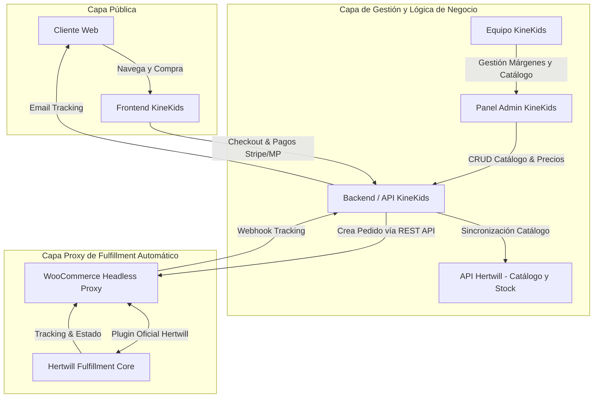

# Plan de Arquitectura e Integración: Frontend Oficial, Admin Panel y Proxy WooCommerce con Hertwill

**Proyecto:** KineKids Web  
**Metodología:** Code Refinement Suite (PACK 1 a PACK 4)  
**Fecha:** 2026-09-24  
**Estado:** Propuesta de Arquitectura y Plan de Implementación  

---

## 1. 🔍 Diagnóstico Inicial y Auditoría

### 1.1. Clarificación sobre "Las 2 Tiendas" (Aclaración Crucial)
En el correo de Roland (Hertwill), cuando menciona:
> *"Una observación útil: en tu cuenta hay dos tiendas. La clave de API está en una y tus 73 productos de la lista de importación están en la otra..."*

**No se refiere a la estructura de archivos de tu repositorio (Frontend vs Admin Panel).**  
Se refiere a la configuración interna dentro de la plataforma **Hertwill (app.hertwill.com)**:
- En tu perfil de Hertwill existen 2 instancias de "Store" creadas.
- En la **Tienda A** generaste tu `API Key`.
- En la **Tienda B** seleccionaste los **73 productos** en la "Import List".
- **Impacto:** Al hacer llamadas con la API Key de la Tienda A, Hertwill no devuelve tus 73 productos porque están aislados en la Tienda B.
- **Acción requerida en Hertwill:** Entrar a Hertwill y unificar todo en una única tienda (generar la API Key en la tienda que contiene los 73 productos o transferir los productos a la tienda con la clave).

---

## 2. 🏛️ Arquitectura del Sistema KineKids

Para cumplir con los requerimientos del negocio y la limitación actual de Hertwill (que aún no dispone de endpoint público directo para crear pedidos vía API), la arquitectura se divide en 3 capas desacopladas:



### 2.1. Componentes del Ecosistema

1. **Frontend Oficial KineKids (Storefront Público):**
   - Interfaz moderna, rápida y optimizada para conversión y SEO.
   - Catálogo de productos con precios finales (PVP calculados).
   - Carrito de compras y pasarela de pagos integrada (Stripe, Mercado Pago, etc.).
   - Consulta de stock en tiempo real.

2. **Backend & Panel Administrativo KineKids:**
   - Panel de control interno para el equipo.
   - **Gestión de Precios y Márgenes:** Reglas de pricing automático (ej: `Coste Hertwill + % margen + IVA`).
   - **Gestión de Catálogo:** Selección de variantes activas, edición de descripciones en español, categorías locales.
   - **Visor de Pedidos:** Estado unificado de pedidos y números de tracking.

3. **WooCommerce Headless Proxy (Puente de Fulfillment):**
   - Instancia mínima y ligera de WordPress + WooCommerce.
   - **Función única:** Actuar como middleware silencioso de pedidos hacia Hertwill mediante el plugin oficial de Hertwill.
   - No está abierto al público general; solo se comunica vía API con el Backend de KineKids.

---

## 3. 🛠️ Investigación Técnica: Integración con la REST API de WooCommerce

### 3.1. ¿Cómo funciona la WooCommerce REST API v3?
WooCommerce ofrece una API REST completa y autenticada mediante claves `Consumer Key` y `Consumer Secret` sobre HTTPS.

- **Endpoint de Creación de Pedidos:** `POST /wp-json/wc/v3/orders`
- **Estructura del Payload:**
```json
{
  "payment_method": "custom_gateway",
  "payment_method_title": "Pago KineKids (Stripe)",
  "set_paid": true,
  "billing": {
    "first_name": "Nombre",
    "last_name": "Apellido",
    "address_1": "Calle Ejemplo 123",
    "city": "Madrid",
    "postcode": "28001",
    "country": "ES",
    "email": "cliente@email.com",
    "phone": "+34600000000"
  },
  "shipping": {
    "first_name": "Nombre",
    "last_name": "Apellido",
    "address_1": "Calle Ejemplo 123",
    "city": "Madrid",
    "postcode": "28001",
    "country": "ES"
  },
  "line_items": [
    {
      "product_id": 105,
      "variation_id": 106,
      "quantity": 1
    }
  ]
}
```

### 3.2. Ciclo de Vida del Pedido y Webhooks
1. **Frontend KineKids:** El usuario completa el pago con éxito.
2. **Backend KineKids:**
   - Guarda el pedido en la base de datos interna.
   - Realiza la llamada `POST /wp-json/wc/v3/orders` con `set_paid: true` hacia el WooCommerce Proxy.
3. **WooCommerce & Plugin Hertwill:**
   - WooCommerce marca la orden como `processing`.
   - El plugin oficial de Hertwill detecta la orden y la envía automáticamente a las marcas proveedoras en Europa.
4. **Actualización de Tracking:**
   - Cuando Hertwill despacha el paquete, actualiza la orden en WooCommerce con el número de tracking.
   - WooCommerce emite un webhook `order.updated` hacia el Backend de KineKids.
   - KineKids envía el correo con el tracking al cliente y actualiza el Admin Panel.

---

## 4. 📋 Plan de Ejecución según Code Refinement Suite

### 📦 PACK 1: Arquitectura y Especificación (Fase Actual)
- [x] Diagnóstico del problema de las dos cuentas/tiendas en Hertwill.
- [x] Definición de la arquitectura desacoplada (Frontend + Admin + WooCommerce Proxy).
- [ ] Especificación del modelo de datos para productos, variantes, costes mayoristas y precios de venta al público (PVP).
- [ ] Mapeo de IDs entre Hertwill API, WooCommerce Proxy y Backend KineKids.

### 📦 PACK 2: Desarrollador (Implementación)
- **Hito 1 (Hertwill Unificación & Catálogo API):**
  - Configurar cliente API de Hertwill en el Backend.
  - Sincronizar los 73 productos, imágenes, tablas de tallas y costes de envío.
- **Hito 2 (Panel Admin - Pricing & Catálogo):**
  - Vistas administrativas para ajustar márgenes por marca/categoría.
  - Activación/desactivación de productos para el frontend.
- **Hito 3 (WooCommerce Proxy Setup):**
  - Despliegue de instancia WooCommerce ligera con plugin de Hertwill conectado.
  - Sincronización inicial de productos entre Hertwill y WooCommerce.
- **Hito 4 (Checkout & Inyección de Pedidos):**
  - Módulo en Backend KineKids para emitir pedidos a WooCommerce REST API al confirmarse el pago.
  - Webhook listener para recibir cambios de estado y códigos de tracking.

### 📦 PACK 3: QA & Testing
- Simulación de compra completa en entorno sandbox:
  - Navegación -> Carrito -> Pago simulado -> Inyección en WooCommerce -> Verificación en Hertwill.
- Verificación de consistencia de stock en tiempo real (evitar venta de productos agotados).
- Pruebas de resiliencia: reintentos en caso de fallo temporal de la API de WooCommerce.

### 📦 PACK 4: Auditor & Protocolo Pre-Despliegue
- Revisión de seguridad de credenciales (variables de entorno seguras para Hertwill API Key y WooCommerce Secrets).
- Auditoría de rendimiento WPO del frontend oficial.
- Verificación de cumplimiento WCAG en el checkout.
- **Protocolo Git:** Esperar aprobación explícita del usuario antes de cualquier `git push`.

---

## 5. 🎯 Próximos Pasos Inmediatos
1. **Acción en Hertwill:** Entrar a tu cuenta y verificar cuál de las dos tiendas tiene los 73 productos para asignarle la API Key correspondiente.
2. **Definición de Hosting WooCommerce:** Confirmar si ya dispones de un hosting/servidor WordPress para levantar el proxy o si prefieres configurarlo en un subdominio (ej: `proxy-orders.kinekids.com`).
