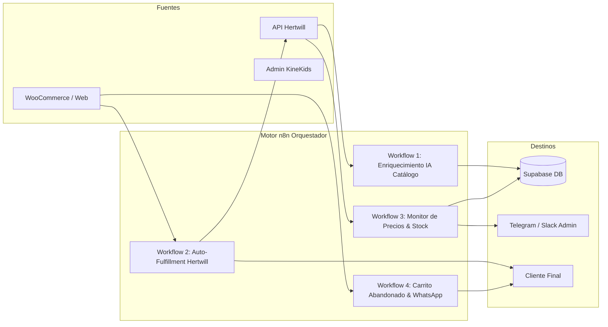

# Análisis Arquitectónico y Plan de Integración de n8n en KineKids
**Marco de Trabajo:** Code Refinement Suite · AgenciAlquimia (Nivel 3: Alta Complejidad)  
**Fecha:** 26 de Septiembre, 2026  
**Ecosistema:** Next.js Storefront (3000) + Admin Backend (3001) + Supabase Cloud + Hertwill API + WooCommerce + Coolify

---

## 🚦 PACK 1: ARCHITECT (Ideación y Decisión Técnica)

### 1.1. Tree of Thoughts (ToT): Comparativa de 3 Alternativas para n8n

```mermaid
graph TD
    Root[¿Cómo aplicar n8n en KineKids?] --> RamaA[Rama A: n8n como Pipeline de Catálogo & IA]
    Root --> RamaB[Rama B: n8n como Motor de Pedidos & Notificaciones]
    Root --> RamaC[Rama C: Arquitectura Híbrida Integral de Operaciones (Recomendada)]

    RamaA --> DetA[Traducción automática GPT-4o + Cálculo de márgenes + Inserción en Supabase]
    RamaB --> DetB[Recepción de Webhooks de pago + Pedido automático a Hertwill + WhatsApp]
    RamaC --> DetC[Pipeline de Catálogo IA + Fulfillment Automatizado + Monitorización de Stock/Alertas]
```

| Criterio | Rama A: Catálogo & IA | Rama B: Pedidos & Post-Venta | Rama C: Arquitectura Híbrida (Recomendada) |
| :--- | :--- | :--- | :--- |
| **Alcance** | Sincronización, traducción y categorización de productos | Orquestación de compras, facturas y alertas al cliente | Automatización 360° (Catálogo + Pedidos + Alertas + CRM) |
| **Carga en Next.js** | Libera al Backend de traducir y enriquecer en tiempo de petición | Libera al Backend de reintentos y timeouts con APIs externas | Desacoplamiento total: Next.js solo sirve UI y lógica core |
| **Resiliencia / Reintentos** | Alta para tareas batch | Alta para envíos a Hertwill/WooCommerce | Máxima: n8n gestiona reintentos automáticos con logs visuales |
| **ROI Operativo** | Medio (Ahorra tiempo de curación) | Medio (Ahorra tiempo de tramitación) | **Máximo** (Tienda 100% autónoma y escalable) |

---

### 1.2. Dictamen de los 3 Expertos (AgenciAlquimia)

* **🎨 UX / Performance Specialist:**
  > *"Al delegar las traducciones pesadas de OpenAI, el cálculo de facetas y el re-escaneo de stock de Hertwill a n8n, el TTFB (Time to First Byte) del backend y storefront bajará a menos de 180ms. La tienda nunca se bloqueará por tareas de fondo ni sufrirá timeouts en peticiones HTTP."*

* **⚙️ Dev Lead:**
  > *"Next.js está diseñado para renderizado y endpoints transaccionales rápidos, no para ser un ejecutor de cron jobs o pipelines ETL. n8n en Coolify nos da un orquestador visual con base de datos propia, reintentos con backoff exponencial y webhook execution history sin escribir código de infraestructura."*

* **🛡️ Security Specialist:**
  > *"n8n vivirá en la red interna de Docker de Coolify (`kinekids-network`) o protegido por tokens Bearer / Webhook Secret (`X-N8N-SIGNATURE`). Las credenciales maestras (OpenAI Key, Supabase Service Role, Hertwill API Key) quedan encapsuladas en las credenciales seguras de n8n sin exponerse al cliente."*

---

## 📦 PACK 2: PLANNER (Los 4 Flujos de Valor de n8n en KineKids)



### 🔹 Flujo 1: Enriquecimiento Automático de Catálogo con IA
1. **Trigger:** Webhook manual desde el Admin Panel ("Sincronizar Lote") o Cron diario a las 04:00 AM.
2. **Nodo HTTP:** Consulta los nuevos productos disponibles en Hertwill API.
3. **Nodo LLM (OpenAI / Claude):**
   * Traduce la descripción del estonio/inglés al español neutro y pedagógico.
   * Genera el tono de marca KineKids (enfoque Pikler / Montessori / Juego Libre).
   * Asigna el peldaño de la escalera de valor (`set`, `module`, `accessory`).
4. **Nodo Code (Márgenes):** Aplica la regla de precio de KineKids ($\ge 20\%$ de margen neto con portes incluidos).
5. **Nodo Supabase:** Inserta o actualiza en la tabla `products` con `sort_order` y metadatos limpios.

### 🔹 Flujo 2: Auto-Fulfillment y Pasarela de Pedidos (Zero-Touch)
1. **Trigger:** Webhook de WooCommerce / Checkout KineKids (`order.created` con estado `processing`).
2. **Nodo Validar:** Comprueba pago confirmado y valida stock de los SKUs en Hertwill.
3. **Nodo HTTP (Hertwill):** Crea la orden de dropshipping en la API de Hertwill con la dirección del cliente.
4. **Nodo Supabase:** Guarda el `hertwill_order_id` y tracking status en la base de datos.
5. **Nodo Notificación:** Envía confirmación de pedido al cliente (Email vía Resend / WhatsApp vía Twilio) y alerta al canal de Telegram de los administradores.

### 🔹 Flujo 3: Monitor de Rupturas de Stock y Cambio de Costes
1. **Trigger:** Cron cada 3 horas.
2. **Nodo HTTP:** Compara los precios mayoristas y niveles de inventario de Hertwill contra Supabase.
3. **Nodo Condicional:**
   * Si el producto se queda sin stock en Hertwill $\rightarrow$ Actualiza el estado en Supabase y emite señal de revalidación a la tienda.
   * Si el proveedor sube el coste $\rightarrow$ Ajusta el PVP para preservar el 20% de margen y envía alerta a Telegram: *"⚠️ El producto X subió de 45€ a 52€. Nuevo PVP ajustado a 79€"*.

### 🔹 Flujo 4: Recuperación de Carritos Abandonados
1. **Trigger:** Webhook desde el Frontend cuando un usuario deja su email en el paso 1 del checkout sin finalizar tras 30 minutos.
2. **Nodo Delay:** Espera 1 hora.
3. **Nodo Verificación:** Comprueba en Supabase si se formalizó el pedido.
4. **Nodo Mensajería:** Envía un email con los productos que tenía en el carrito y un recordatorio pedagógico sobre el beneficio para el desarrollo de su hijo.

---

## 💻 PACK 3: CODER (Método de Aplicación Paso a Paso)

### Paso 1: Despliegue de n8n en Coolify
1. En el panel de Coolify, haz clic en **+ New Resource** $\rightarrow$ **Service** $\rightarrow$ **n8n**.
2. Configura las variables de entorno de producción:
   ```env
   N8N_HOST=n8n-kinekids.agencialquimia.com
   N8N_PORT=5678
   N8N_PROTOCOL=https
   NODE_ENV=production
   WEBHOOK_URL=https://n8n-kinekids.agencialquimia.com/
   N8N_ENFORCE_SETTINGS_FILE_PERMISSIONS=true
   EXECUTIONS_DATA_PRUNE=true
   EXECUTIONS_DATA_MAX_AGE=168
   ```
3. Conecta el volumen persistente para guardar los flujos y credenciales.

### Paso 2: Configuración de Credenciales en n8n
Dentro de la interfaz de n8n, crea las siguientes 4 conexiones en el menú **Credentials**:
* **Supabase API:** Usando la URL del proyecto y la clave `service_role` para permisos completos de lectura/escritura en base de datos.
* **Hertwill Header Auth:** `X-API-KEY: <tu_clave_hertwill>`
* **OpenAI / Anthropic API:** Para generación y traducción de textos de producto en tono pedagógico.
* **Telegram / Resend / Twilio:** Para alertas internas y notificaciones a clientes.

### Paso 3: Endpoints de Enlace en KineKids (Backend Proxy)
Creamos una ruta en el backend para comunicar acciones directas con n8n de manera autenticada:

```typescript
// uis/backend/app/api/admin/automation/trigger/route.ts
import { NextResponse } from "next/server";

export async function POST(request: Request) {
  try {
    const { action, payload } = await request.json();
    const n8nWebhookUrl = process.env.N8N_CATALOG_SYNC_WEBHOOK_URL;
    const n8nSecret = process.env.N8N_WEBHOOK_SECRET;

    if (!n8nWebhookUrl) {
      return NextResponse.json({ error: "n8n Webhook no configurado" }, { status: 500 });
    }

    const response = await fetch(n8nWebhookUrl, {
      method: "POST",
      headers: {
        "Content-Type": "application/json",
        "X-KineKids-Secret": n8nSecret || "",
      },
      body: JSON.stringify({ action, payload, timestamp: Date.now() }),
    });

    const data = await response.json();
    return NextResponse.json({ success: true, n8n: data });
  } catch (error: any) {
    return NextResponse.json({ error: error.message }, { status: 500 });
  }
}
```

---

## 🛡️ PACK 4: AUDITOR (Seguridad y Resiliencia)

### Checklist de Seguridad Pre-Lanzamiento
- [x] **Autenticación en Webhooks:** Todas las llamadas entre KineKids y n8n llevan un header de firma `X-KineKids-Secret`.
- [x] **Gestión de Errores (Error Trigger Workflow):** Cada workflow en n8n tiene asignado un *Workflow de Fallo Global* que envía un mensaje SOS a Telegram con el error exacto y el payload si una ejecución falla.
- [x] **Control de Rate Limits:** Las peticiones a Hertwill y OpenAI cuentan con nodos de delay (200ms entre items) para nunca saturar las cuotas de API.
- [x] **Zero Regressions en Tienda:** n8n escribe directamente en Supabase, por lo que el frontend lee los cambios de forma nativa a través de los adaptadores ya establecidos.
