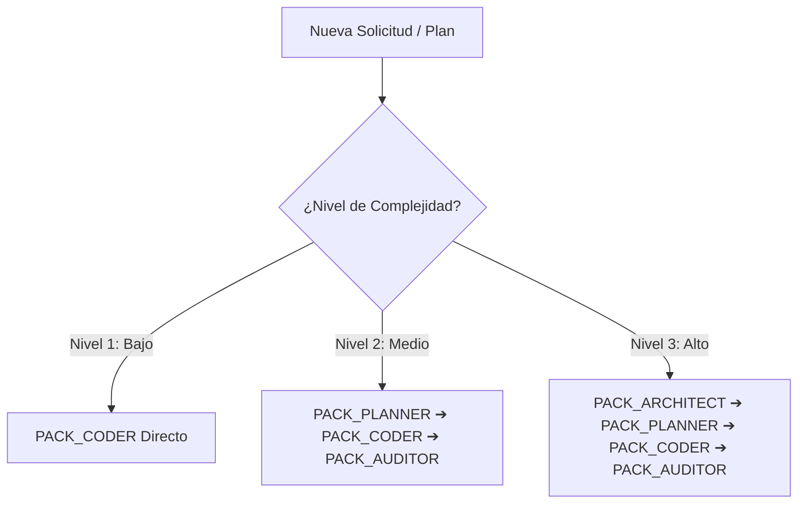

# Code Refinement Suite · AgenciAlquimia

Esta skill rige el ciclo de vida completo desde la concepción de un **Implementation Plan** hasta la validación previa al envío del código en AgenciAlquimia.

---

## 🚦 Clasificación Adaptativa por Niveles de Complejidad

Al recibir una nueva solicitud o plan, la IA evalúa automáticamente su nivel de criticidad para aplicar el nivel de exigencia adecuado:



### 🔹 Nivel 1: Tarea Simple / Quick Fix (Baja Complejidad)
- **Ejemplos:** Ajuste de margen CSS, corrección de tipografía, actualización de un comentario o typo.
- **Protocolo:** Se aplica directamente `PACK_CODER` (Verificación de código y comprobación de build).

### 🔹 Nivel 2: Nueva Funcionalidad / Componente (Complejidad Media)
- **Ejemplos:** Nuevo componente UI, endpoint de API proxy, nueva tabla o vista del panel admin.
- **Protocolo:** 
  1. `PACK_PLANNER`: Redacción de `implementation-plan.md` con refinamiento en 3 ciclos.
  2. `PACK_CODER`: Implementación con verificación CoVe fáctica y pruebas de compilación (`tsc`, `lint`, `test`).
  3. `PACK_AUDITOR`: Verificación ligera de seguridad y responsividad.

### 🔹 Nivel 3: Arquitectura / Módulo Crítico (Alta Complejidad)
- **Ejemplos:** Integración de microservicios (Python Core, n8n), autenticación JWT, esquemas DB Supabase, pasarelas de pago.
- **Protocolo Riguroso Completo:**
  1. `PACK_ARCHITECT`: Comparativa ToT de soluciones alternativas con análisis de los 3 Expertos (UX, Dev, Sec).
  2. `PACK_PLANNER`: Abstracción de diseño y 3 ciclos de refinamiento crítico en `implementation-plan.md`.
  3. `PACK_CODER`: Desarrollo guiado por verificaciones fácticas y suite de tests unitarios/integrados.
  4. `PACK_AUDITOR`: Simulación de ataques Red Teaming, auditoría WCAG 2.1 AA / WPO y checklist pre-push.

---

## 📦 Especificación de los 4 Paquetes Modulares

### 📐 PACK 1: ARCHITECT (Ideación y Decisión Técnica)
- **Herramientas:** `Tree of Thoughts (ToT)` + `3 Expertos (UX/UI, Dev Lead, Sec Specialist)`.
- **Acción:** Evalúa 3 ramas alternativas con sus ventajas, riesgos y costos antes de redactar el plan.

### 📝 PACK 2: PLANNER (Estructuración del Plan de Implementación)
- **Herramientas:** `Step-Back Prompting (Abstracción)` + `Self-Refinement Loop (3 Ciclos)`.
- **Acción:** Define componentes desacoplados y refina el documento `implementation-plan.md` hasta dejarlo impecable.

### 💻 PACK 3: CODER (Desarrollo y Verificación Fáctica)
- **Herramientas:** `Chain of Verification (CoVe)` + `Test-Driven Refinement (TDD)`.
- **Acción:** Contrasta los tipos e importaciones contra el código fuente real y ejecuta validaciones automatizadas (`npx tsc --noEmit`, `npm run lint`, `npm test`, `pytest`).

### 🛡️ PACK 4: AUDITOR (Pre-Despliegue y Protocolo Git)
- **Herramientas:** `Red Teaming (Simulación de Ataques)` + `Checklist WCAG/WPO`.
- **Acción:** Audita el código buscando fallos de seguridad, regresiones o problemas de rendimiento.

---

## 🛑 Regla Inviolable de Control de Git

```
⚠️ NUNCA realizar `git push` de forma automática.
Al finalizar el ciclo del PACK 4, la IA DEBE detenerse y solicitar consentimiento explícito:

"El Implementation Plan y el código han pasado todas las pruebas de la Skill (PACK 1-4).
¿Deseas que ejecute 'git push' hacia la rama <nombre_rama> o prefieres revisar algo más?"
```
