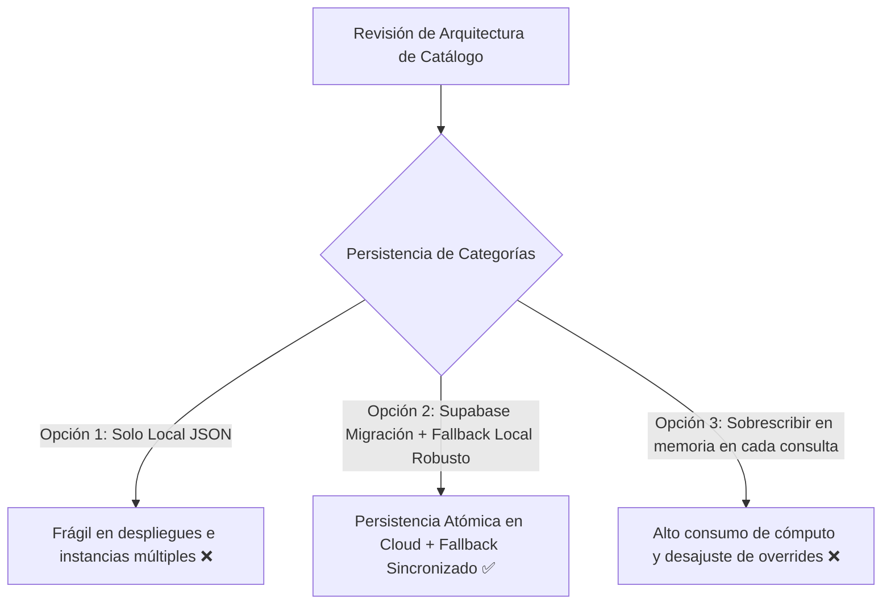

# Implementation Plan · Resolución de Persistencia y Clasificación de Categorías

> **Marco de Referencia:** Code Refinement Suite · AgenciAlquimia (Nivel 2 / 3: Catálogo, Persistencia y Arquitectura Hexagonal)

---

## 1. Resumen Ejecutivo y Diagnóstico

### 1.1. Problema Identificado
Al agregar o editar nuevos productos desde el catálogo de Hertwill o en el panel de Curados (`/admin/curados` y `/admin/catalogo`), la asignación de categoría no se persiste adecuadamente o es revertida a categorías por defecto (`set` o `module`), impidiendo que productos como **Camas Montessori, Literas, Camas Cabaña y Estanterías** se ubiquen y mantengan en la categoría oficial **Mobiliario & Estanterías (Montessori)** (`furniture`) o **Cunas & Carritos** (`nursery`).

### 1.2. Causas Raíz Detectadas
1. **Ingesta con Heurística de Precio en lugar de Semántica (`lib/hertwill.ts`):** `getHertwillProducts()` asigna categorías fijas (`>80€ ➔ set`, `>=20€ ➔ module`) sin invocar al clasificador pedagógico `classifyProduct()`.
2. **Cortocircuito en `classifyProduct()` (`lib/classifier.ts`):** Si un producto ya trae una categoría válida previa (la asignada erróneamente por coste), se cortocircuita y nunca ejecuta las reglas heurísticas ni semánticas.
3. **Falta de Tabla `app_config` y Restricción CHECK en Supabase:**
   - La tabla `public.app_config` no existe en la base de datos de Supabase (`PGRST205`), impidiendo la persistencia en nube de `category_overrides`.
   - La tabla `public.products` mantiene un constraint `23514` heredado (`CHECK (category IN ('set', 'module', 'accessory'))`), degradando forzosamente `furniture ➔ module` y `nursery ➔ set`.
4. **Fusión Forzosa de Categorías en Agrupación de Variantes (`lib/variants.ts`):** `groupCuratedProducts()` aplica una regla de prioridad rígida donde si cualquier variante tiene categoría `set` o `module`, fuerza a todo el grupo a esa categoría en lugar de respetar la asignación del grupo curado.

---

## 2. Casos de Estudio y Validación Fáctica (Productos de Ejemplo del Usuario)

Los siguientes 15 productos reales añadidos por el usuario sirven como banco de pruebas (Benchmark Suite) para certificar que la asignación a **Mobiliario & Estanterías (`furniture`)** sea permanente y robusta:

| # | Producto Base | Tipo / Variantes | Coste (€) | PVP Sugerido / Editado (€) | Categoría Requerida |
| :---: | :--- | :---: | :---: | :---: | :---: |
| **#1** | **PLOTTY Single Bed with Front Safety Rail** | 2 Variantes (90 cm, 120-140 cm) | 196,75 € | 288,00 € | `furniture` (Mobiliario & Estanterías) |
| **#2** | **COTTAGE Raised House Bed with Full Roof and Storage Stairs** | Producto Único | 1365,46 € | 1749,00 € | `furniture` (Mobiliario & Estanterías) |
| **#3** | **MAKALU de Madera Loft Bed with Desk** | Producto Único | 538,13 € | 714,00 € | `furniture` (Mobiliario & Estanterías) |
| **#4** | **ALPY House Bunk Bed with Ladder** | Producto Único | 433,65 € | 584,00 € | `furniture` (Mobiliario & Estanterías) |
| **#5** | **SAFARI Jeep de Madera Children's Car Bed** | Producto Único | 338,28 € | 465,00 € | `furniture` (Mobiliario & Estanterías) |
| **#6** | **LUCKY Single Bed with Open Entrance** | 2 Variantes (120-140 cm, 80-90 cm) | 167,59 € | 251,00 € | `furniture` (Mobiliario & Estanterías) |
| **#7** | **TULY Low de Madera Bed with Safety Rail** | 2 Variantes (120-140 cm, 90 cm) | 257,49 € | 364,00 € | `furniture` (Mobiliario & Estanterías) |
| **#8** | **COTTAGE Loft Bed with Half Roof and Storage Stairs** | Producto Único | 1226,36 € | 1575,00 € | `furniture` (Mobiliario & Estanterías) |
| **#9** | **PLOTTY Bunk Bed with Storage Stairs** | Producto Único | 830,31 € | 1080,00 € | `furniture` (Mobiliario & Estanterías) |
| **#10** | **LUCKY House Bed with Front Roof and Safety Rail** | 2 Variantes (120-140 cm, 80-90 cm) | 260,53 € | 367,00 € | `furniture` (Mobiliario & Estanterías) |
| **#11** | **ATLAS de Madera Children's Bunk Bed** | Producto Único | 393,56 € | 534,00 € | `furniture` (Mobiliario & Estanterías) |
| **#12** | **LUCKY House Bed with Side Roof and Front Safety Rail** | 2 Variantes (120-140 cm, 90 cm) | 262,96 € | 370,00 € | `furniture` (Mobiliario & Estanterías) |
| **#13** | **ARARAT de Madera Bunk Bed for Three** | Producto Único | 300,63 € | 418,00 € | `furniture` (Mobiliario & Estanterías) |
| **#14** | **COTTAGE Bunk Bed with Half Roof and Storage Stairs** | Producto Único | 1330,22 € | 1705,00 € | `furniture` (Mobiliario & Estanterías) |
| **#15** | **Estantería Modular Montessori Arco (3 Baldas)** | 3 Variantes de Color | 125,75 € | 176,00 € | `furniture` (Mobiliario & Estanterías) |

---

## 3. PACK 1: ARCHITECT (Decisión Técnica y Evaluación ToT)



### Análisis de los 3 Expertos
1. **UX/UI Expert:** La tienda debe mostrar las camas y mobiliario en su familia correspondiente (**Mobiliario Montessori**), permitiendo a los padres navegar intuitivamente sin mezclar camas infantiles con módulos de espuma o piscinas de bolas.
2. **Dev Lead:** La arquitectura hexagonal debe ser respetada: el repositorio abstracto (`CatalogRepository`) debe coordinar `SupabaseCatalogAdapter` y `LocalFileCatalogAdapter`, garantizando que un fallo de red o esquema en Supabase no corrompa los overrides ni bloquee la actualización del catálogo.
3. **Security / Red Team:** La manipulación de categorías y precios en endpoints `/api/admin/*` debe validar tipos estrictos (`ProductCategory = "set" | "module" | "furniture" | "nursery" | "accessory"`) para evitar inyecciones de payloads arbitrarios en Postgres o archivos JSON.

---

## 4. PACK 2: PLANNER (Fases de Implementación)

### 🔹 Fase 1: Motor de Clasificación Semántica (`lib/classifier.ts` y `lib/hertwill.ts`)
- **Reglas Heurísticas para Camas y Mobiliario:**
  - Agregar a la familia `furniture`: `bed`, `cama`, `bunk`, `litera`, `loft`, `house bed`, `car bed`, `bunk bed`, `plotty`, `cottage`, `makalu`, `alpy`, `safari`, `lucky`, `tuly`, `atlas`, `ararat`.
  - Asegurar que `classifyProduct(title, desc, currentCat, overrides, id)` dé **prioridad absoluta a los `overrides[id]`** y, en su defecto, evalúe la semántica del producto si `currentCat` provino de la inferencia genérica.
- **Ingesta de Hertwill (`lib/hertwill.ts`):**
  - Reemplazar la asignación rígida por coste en `getHertwillProducts()` para que aplique `classifyProduct(p.name, p.description, "", overrides, String(p.id))`.

### 🔹 Fase 2: Persistencia Hexagonal y Resiliencia en Supabase
- **Script SQL de Migración (`docs/sql-5-categorias-migration.sql`):**
  - Actualizar `CHECK CONSTRAINT` en `public.products` para aceptar `('set', 'module', 'furniture', 'nursery', 'accessory')`.
  - Crear tabla `public.app_config (key text primary key, value jsonb, updated_at timestamp with time zone default now())`.
- **Adaptador Supabase (`SupabaseCatalogAdapter.ts` y `category_overrides.ts`):**
  - Manejo resiliente de `app_config` con fallback fluido a `data/category_overrides.json`.
  - Persistencia de la categoría a nivel de variante y a nivel de producto base.

### 🔹 Fase 3: Paneles Admin y Agrupación de Variantes (`variants.ts`, `catalogo/`, `curados/`)
- **Agrupador de Variantes (`lib/variants.ts`):**
  - Modificar `groupCuratedProducts()` para respetar la categoría asignada al representante o la categoría más específica del grupo, sin forzar `set`/`module` sobre `furniture`/`nursery`.
- **Panel de Curados (`app/admin/curados/page.tsx`):**
  - En `handleGroupCategoryChange`: propagar la nueva categoría a todos los ítems (`p.category = newCategory`) y guardar inmediatamente en overrides.
- **Panel de Catálogo (`app/admin/catalogo/page.tsx`):**
  - En `handleUpdateCategory` y `handleSyncProduct`: asegurar que el tipo soporte las 5 categorías y persista el override al hacer click en "Añadir".

---

## 5. PACK 3: CODER (Plan de Verificación CoVe y TDD)

### Verificaciones Fácticas:
1. **Compilación estricta de TypeScript:**
   ```bash
   npm run build # o npx tsc --noEmit
   ```
2. **Suite de Tests Automatizados (`unit-test/suite.test.mjs`):**
   - Test unitario validando que los 15 productos del usuario clasifiquen como `furniture`.
   - Test de persistencia de overrides: guardar override `10114 ➔ furniture` y verificar que la lectura lo devuelva inalterado.
   - Test de agrupación de variantes: verificar que un grupo con múltiples colores de `PLOTTY Single Bed` preserve `category: "furniture"`.

---

## 6. PACK 4: AUDITOR (Checklist Pre-Despliegue y Protocolo Git)

- [ ] Las 15 camas y estanterías del ejemplo se muestran en la pestaña "📚 Mobiliario Montessori".
- [ ] Cambiar de categoría en `/admin/curados` actualiza la UI instantáneamente y persiste tras recargar la página.
- [ ] La tienda pública (`/`) refleja los cambios sin caché obsoleta en `sessionStorage`.
- [ ] No existen errores no controlados en la consola del navegador ni en los logs del servidor.
- [ ] **Control de Git:** Detenerse antes de `git push` y solicitar consentimiento explícito del usuario.
